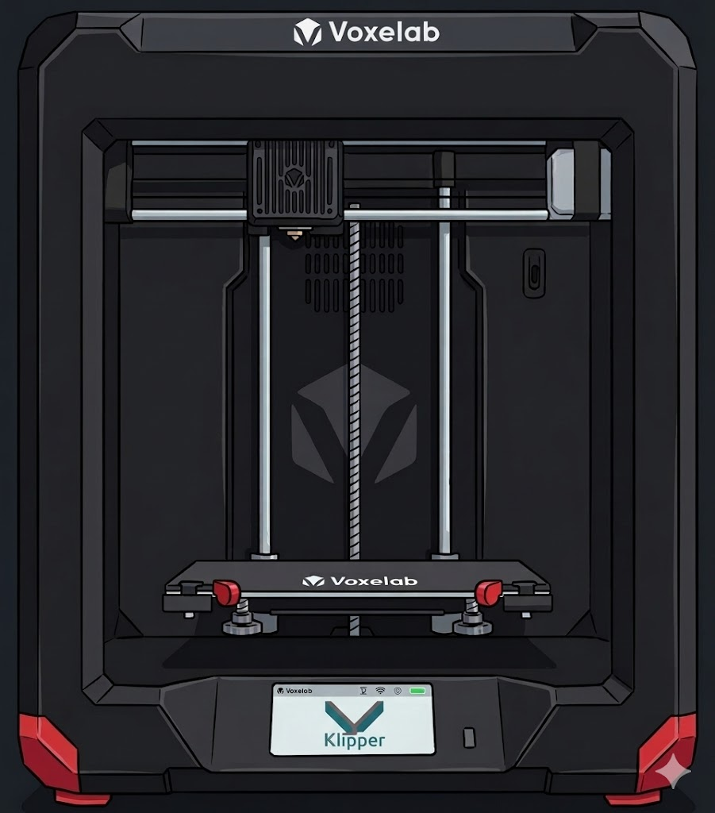

# **KLIPPER FOR THE VOXELAB ARIES 3D PRINTER** 

Run Klipper on a Raspberry Pi or Lunux device to control the Voxelab Aries

  

**WORKING, BUT STILL IN PROGRESS**

Project fork of goopsie/aries-klipper-flash-script with extras from myself, other usefull sources are listed.

Added extra info for config changes, LEDS, MACROS, leveling, slicer profiles and more to come! 

**NOT COMPLETE, USE AT OWN RISK** 

## **CONTENTS**

[Pre-Install](#PRE-INSTALL)

[Install](#INSTALL)

[Post-Install](#POST-INSTALL)

  - [Bed-Leveling](#BED-LEVELING)

  - [Loading Filament](#LOADING-FILAMENT)

  - [Print Optimisation](#PRINT-OPTIMISATION)

  - [Slicer Profile](#SLICER-PROFILE)

  - [PID Calibration](#PID-CALIBRATION)

  - [Bed Probes](#BED-PROBES)

  - [Macros](#MACROS)

  - [LEDs](#LEDS)

  - [Fans](#FANS)

[Uninstall](#UNINSTALL)

[Credits and Contributions](#CREDITS-CONTRIBUTIONS)

### **PRE-INSTALL**
_________

- Install [SRECORD](https://srecord.sourceforge.net/), for converting klipper.bin file to work on the Voxelab (Works on Windows and Linux)

> *Windows: if installing srecord to a non-default directory, "to-hex.bat" will not work out of the box.

- Install Klipper host software to a Linux device of your choosing eg. Raspberry Pi.

> *[KIAUH](https://github.com/dw-0/kiauh) installer Recommended

- Connect printer to Klipper device via RX - TX pins on main board [Wiring Reference](images/wiring_reference.png)

 - Raspberry Pi: Wire Rx on Printer to Tx pin on Pi, Wire Tx on Printer to Rx pin on Pi 

 - USB Serial Converter: Wire Rx on Printer to Tx on Serial Adapter, Tx on Printer to Rx on Serial Adapter, no other pins needed.

 - Onboard ch340 Serial converter: Can be used by connecting usb cable to pins on [LCD Board](images/onboard_ch340-pinout.png)

- Format USB drive and Download this repo as .zip, extract all files to a USB drive, Make sure the usb drive shows up in your printer's menus before continuing.

### **INSTALL**
__________

- On klipper host run "make menuconfig" with settings as shown: [Make Settings](images/makemenuconfig-settings.png)

 - Serial Settings need to be adjusted according to connected device, see: [Serial Settings](images/makemenuconfig_serial.png)

> *(LCD) if using onboard ch340 Serial for usb connection
	
> *(PADS) if using rx-tx connections

 -If you cant get connection using "Internal Clock" for Clock Reference, you will need to use 12Mhz clock
  -Modify klipper/src/stm32/Kconfig with the following:

    #default 128000000 if MACH_N32G45x # old line
    default 144000000 if MACH_N32G45x  # new line

 
- Run "make" on klipper host

- Drag resulting klipper.bin onto root of USB drive.

- Convert klipper.bin to firmware.hex

> Windows: run "to-hex.bat" file also located on USB drive.
	
> Linux:  open terminal in root of USB drive, run: srec_cat klipper.bin -binary -offset 0x08000000 -output firmware.hex -Intel.

- You should see a new "firmware.hex" file was created on the USB drive.

- Turn off printer, if not off already. 

- Plug drive into printer, turn printer on.

 - You will see progress images come up on-screen, firmware.hex file will be automatically flashed to the mainboard via voxelab's built in programming tool.

 - On completion you will recieve a promt to connect your klipper host to the printer
	
>  *Suggested you unplug the ribbon cable connecting the main board to the screen board as this cant be used anymore. 

 > *Screen can be removed and use KlipperScreen on Raspberry Pi Screen in place of original (Optional)
	
 > *Stock USB port can be re-wired to a usb plug and connected to Pi (Optional) [USB Pinout](images/front_usb_pinout.png)

- If using Raspberry Pi, you should already have rx-tx connected.

- If using other linux device, connect to printer via USB Serial Converter. 

- On another device, Open your chosen webUI (Fliudd/Mainsail) via the IP listed in the KIAUH UI during install, it wont have connection to your printer yet. 

 - Copy and replace the printer.cfg on the printer with the one in this repo using the web interface
	
- Restart Klipper
	
- Printer should now be connected to Klipper

**Follow steps below ONLY if your printer isnt automatically found* 

- You may need to update the printer.config with the serial port your printer is
   using:

On Klipper host, Run in terminal/ssh:
	ls /dev/serial/by-id/* 
	
- Change below in your printer.cfg, replace * with the device name show from command above 

	[mcu]
	serial: /dev/serial/by-id/*

- You should now have basic functionality of the printer, complete Leveling (Below) and any other optional extra steps to get extra functiality before printing for the first time.

### **POST-INSTALL**
___________

### **CONFIG-CHECKS**

- The printer should work fine after installing. If you are worried or feel the need you can run [Configuration Checks](https://www.klipper3d.org/Config_checks.html?h=pid#configuration-checks) to ensure all sensors and motors are working correctly. 

### **CALIBRATE-PID**

- On the Web interface (Fluidd/Mainsail) run boh Hotend and Heatbed PID calibration commands in the command terminal to ensure precise heating.

Hotend Calibration:

	PID_CALIBRATE HEATER=extruder TARGET=220 #CHANGE TO EXTRUDER TEMP OF FILAMENT TO BE USED
	SAVE_CONFIG

Hotbed Calibration: 

	PID_CALIBRATE HEATER=heater_bed TARGET=60 #CHANGE TO BED TEMP OF FILAMENT TO BE USED

 - Run in the command terminal to save adjustments:

 	SAVE_CONFIG

### **BED-LEVELING**

- Use the front bed screws to make any adjustments to pre level the bed as best as possible, have the front slightely lower than the rear if possible.
  *In WebUI Settings, Invert the Z-Axis Controls so that + goes up and - goes down 

- Use the Klipper [Manual Leveling](https://www.klipper3d.org/Manual_Level.html#manual-leveling) guide for detailed instructions.

 *Procedure is: 0: Rear Stationary Screw, 1: Left Adjustable Screw, 2: Right Adjustable Screw

**Adjust Rear Stationary Screw Z-Height**

- In the Fluidd/Mainsail webUI:

 - Press the HOME ALL Axis Button and wait for printer to Home and lift the bed up to the nozzle. 

 - Press REAR_SCREW button in the Macro window to move nozzle over rear screw. 

 >  *adjust z -xis towards the nozzle small amounts at time (0.00 SHOULD be nozzle directly on the bed), I ended up with 0.35 z offset for example

 -Run the following in the WebUi command terminal and follow the [Paper Leveling](https://www.klipper3d.org/Bed_Level.html#the-paper-test) procedure:

 	Z_ENDSTOP_CALIBRATE

 - 'ACCEPT' the changes once satisfied

 - Run to save adjustments:

 	SAVE_CONFIG
	

**Adjust Front Screw Z-Heights**

- On the Fluidd/mainsail webUI command terminal:

> *As the front of bed is floating and unsupported, Try not to put pressure on the bed while adjusting and taking measure with the paper as this will dramatically affect the bed height.

 - Run the following, then follow [Paper Leveling](https://www.klipper3d.org/Bed_Level.html#the-paper-test) procedure for the 2 front screws:

 > *'ACCEPT' and skip 'Screw 1' as this screw can not be adjusted. 

 	BED_SCREWS_ADJUST 

 - For the first adjustment of the front screws press 'Adjusted' after adjusting to move to the next. After re-adjusting a second time, press 'ACCEPT' for each.

 - Run to save adjustments:

 	SAVE_CONFIG

### **LOADING FILAMENT**

- Load Filament into Extruder unit on back of printer
 - On Mainsail/Klipper WebUi Press LOAD_FILAMENT on the Macro panel
  -Extruder will heat up and filament will be fed through extruder. 

- To Unload, press UNLOAD_FILAMENT on the Macro panel. This will heat the extruder and pull the filament back out of the extruder. 

### **PRINT OPTIMISATION**

- To get the best quality prints out of your machine, follow the [Resonance Compensation](https://github.com/Klipper3d/klipper/blob/master/docs/Resonance_Compensation.md) and [Pressure Advance](https://www.klipper3d.org/Pressure_Advance.html#pressure-advance) guides. 

- Other guides like [Excluding Objects](https://www.klipper3d.org/Exclude_Object.html#exclude-objects) can add extra controls, find more features and controls under the sidebar of the linked page.  

### **SLICER PROFILE**

- Included in the repo is an ORCA SLICER .3mf project

 - Import this into Orca Slicer (File->Open Project)
 - 
 - Save the Aries Profile and Print Settings by editing the names and saving each as a 'User Preset'
 - 
   -See screenshots in folder for info

- Currently only 1 available and tested profile that has basic settings for 0.4mm Nozzle and PLA Filament.

- More to come! Submissions welcome! 

### **BED-PROBES**

**(NOT TESTED)**

- BL touch or other clones can be plugged directly into the hotend board via the 5 pin socket 
- Useful for for Bed Mesh Probing and Z-Axis Homing

 - [Hotend Board Pinout](images/hotend_pinout.png)
 
 - [Probe Pinouts](images/probe_pinout.png)

- The below lines are the mapped pins for the hotend board, Copy into your printer.config
	[bltouch]
	sensor_pin: ^PB1
	control_pin: PB0

- Follow [BLTouch](https://www.klipper3d.org/BLTouch.html#bl-touch) to set up BL Touch sensor with your printer

> *Other sensors can be used but are WIP and not covered in this guide yet.
 

### **MACROS**

- Macros in the provided printer.config will provide basic functionality. To gain further control, you can add your own macros to gain extra control. 

> *Additional macros will be added in the future, any submissions are welcome. 

### **LEDS** 
- You can add additional ARGB leds eg. for chassis lighting 

 - See [Wiring Reference](images/wiring_reference.png) for pads on the mainboard.

  - Solder the "Data" line from the ARGB led strip to r99 on the Aries mainboard 

  - Solder 5v and Ground wires from ARGB led strip to LCD connector pins (or other 5v/Gnd source)

- The following lines in your printer.cfg adjust the control, adjust 'initial' values as needed for the led color when when turning on printer. 

	[neopixel chassis_lights]
	pin: PA15
	chain_count: 1   # NUMBER_OF_LEDS_HERE
	color_order: GRB # depends on strip
	initial_RED: 1   # if you want
	initial_GREEN: 1 # if you want
	initial_BLUE: 1  # if you want

- Led brightness and Color can now be adjusted in your chosen interface (Fluidd/Mainsail/KlipperScreen)

### **FANS**

**(UNTESTED)**

- Unused fan PA0 in printer.cfg is: [FAN1](images/PA0_fan_plug.png)on the printer mainboard 

- Can be used to add a additional fan to the printer

- Modify printer.cfg as per [Fans](https://www.klipper3d.org/Config_Reference.html?h=fan#fans), to gain control of the fan, eg. when hotend is on:
	
	[controller_fan mcu_fan1]
	pin: PA0
	max_power: 0.75
	heater: extruder

### **UNINSTALL**
_____

- Reverting to stock firmware is simple, just follow steps below

 - Un-solder uart pins from Mainboard, plug back in screen cables and any others you may have unplugged

 - Turn the printer as normal.

 - You'll get a [Prompt on-screen](images/update_failed.png), stating "The firmware failed to update. Press OK to retry", with an "OK" button.

 - Once you press the button, the LCD board will flash the original firmware to the Mainboard, 

 - You can now use the printer as normal.

### **CREDITS-CONTRIBUTIONS**
__________

Couldnt have done without: Original project owner, infinte help on reddit.

 @GOOPSIE (Git) OopsieGoopsie (Reddit)

  https://github.com/goopsie/aries-klipper-flash-script

  https://www.reddit.com/r/VoxelabAries/comments/1lna0p0/got_klipper_flashed_to_my_aries/
___________________

Bed Leveling Macros and Configs.

 @LaszloLitaus_2081172 (Printables.com) 

  https://www.printables.com/model/881037-voxelab-aries-converter-plates/files

